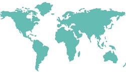

```{r setup, include=FALSE}
pacman::p_load(pacman)
p_load(knitr, tidyverse)
p_load(lubridate, sf, USAboundaries, ggrepel, maps, leaflet, dygraphs, data.table, DT)

opts_chunk$set(echo = TRUE)
```

```{r read_function}
my_read <- function(df){read_csv(df) %>% unique() %>% na.omit()}
```

```{r read_data, eval=FALSE}
dat <- my_read("https://github.com/BYUI-COVID/read-data/raw/master/owid_data.csv") %>% 
  group_by(date) %>% 
  mutate(cases = sum(total_cases)) %>% 
  mutate(deaths = sum(total_deaths))
```

```{r map, out.width = "50%"}

```

## Current

```{r current,eval=FALSE}
yesterday_data <- dat %>% filter(date >= (Sys.Date()-1)-weeks(2))

kable(yesterday_data)
```

<br /> <br />

## World Data

The two [data sources](https://byui-covid.github.io/Project-Reports/ref_data.html) for COVID-19 in the USA are JHU and Our World In Data.
